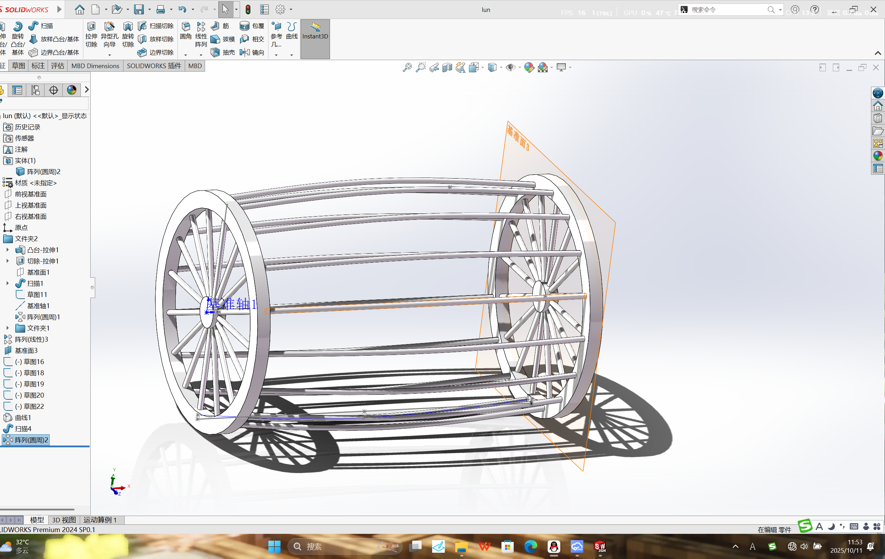
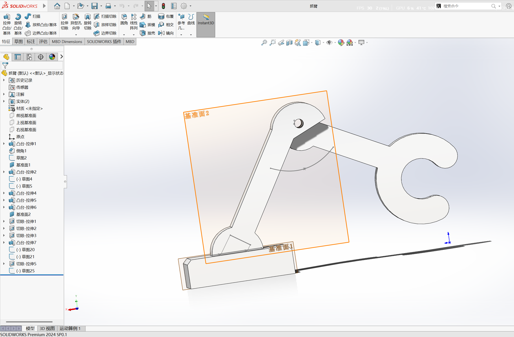
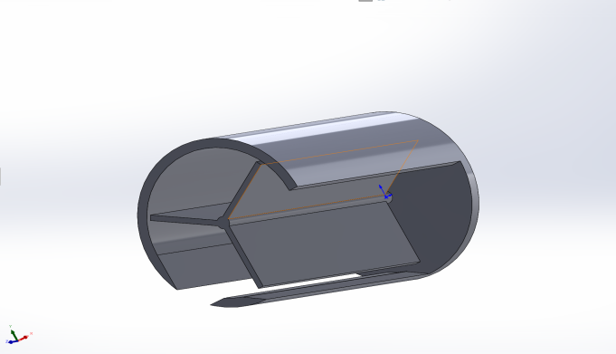

[TOC]

# 机器人的设计思路

在拿到题目时，看到是关于小球收集的小车，于是有了以下第一套初始方案：

1、将底盘设计为双层，通过长钉与螺帽固定连接形成小车初始整体支架。

2、对于驱动系统，采用tt马达带动麦克纳姆轮，通过速度调控使每个轮子达到不同速度从而实现前进，转向等不同移动功能。

3、对于小车实现摄取、携带等高级功能的问题，初步设计了一种机械臂与铲斗结合的采集方式需要3个舵机实现。

而在仔细思考后，加上电控难度过大等实际问题困扰于是对高级功能迭代出以下两种方案：

## 方案一

以网球收集器作为灵感来源对高级功能作出改动

1、将底盘设计为双层，通过长钉与螺帽固定连接形成小车初始整体支架。（同初始方案）

2、对于驱动系统，采用tt马达带动麦克纳姆轮，通过速度调控使每个轮子达到不同速度从而实现前进，转向等不同移动功能。（同初始方案）

 3、对于高效收集小球问题，采用圆柱形笼式容器（见下图），实现所及之处小球自动嵌入并完成携带，两侧采用抓臂实现固定（见下图）。

## 方案二

同样是对高级功能作出改动，此方案则是基于扫地机器人原理获得灵感。

1、将底盘设计为双层，通过长钉与螺帽固定连接形成小车初始整体支架。（同初始方案）

2、对于驱动系统，采用tt马达带动麦克纳姆轮，通过速度调控使每个轮子达到不同速度从而实现前进，转向等不同移动功能。（同初始方案）

 3、将原本机械臂删除设计成固定的四分之三封闭且中空圆柱体，在中间插入电机带动辐条转动从而达到收集小球的目的（见下图）。

