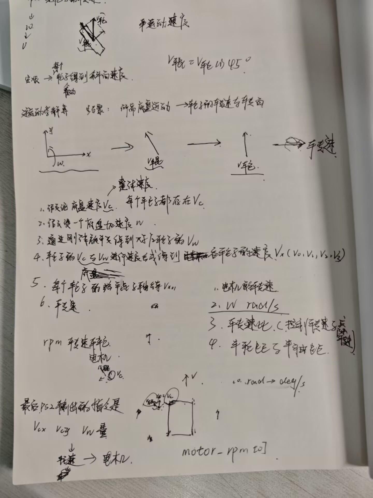
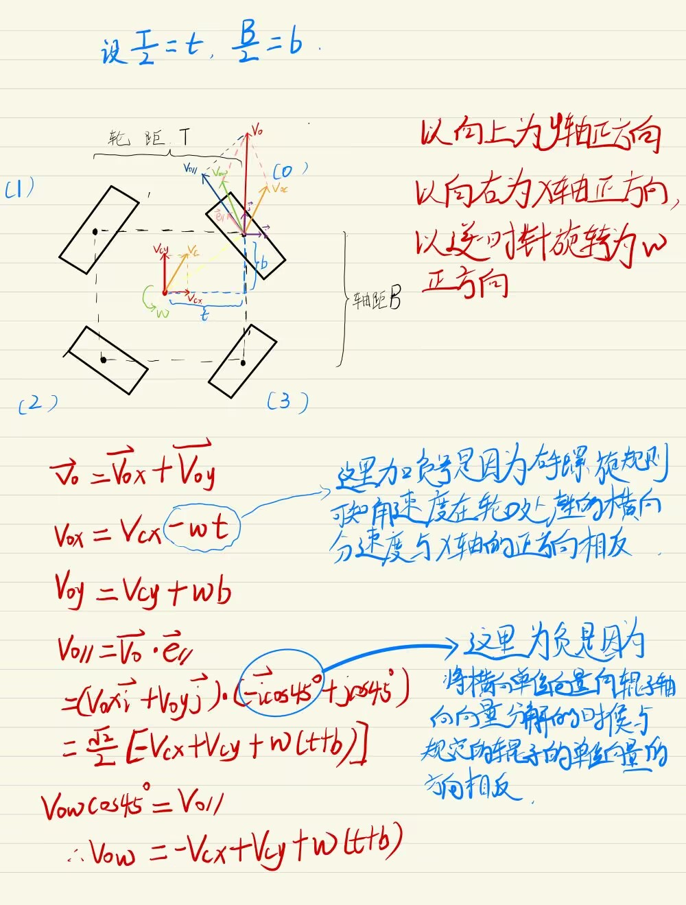
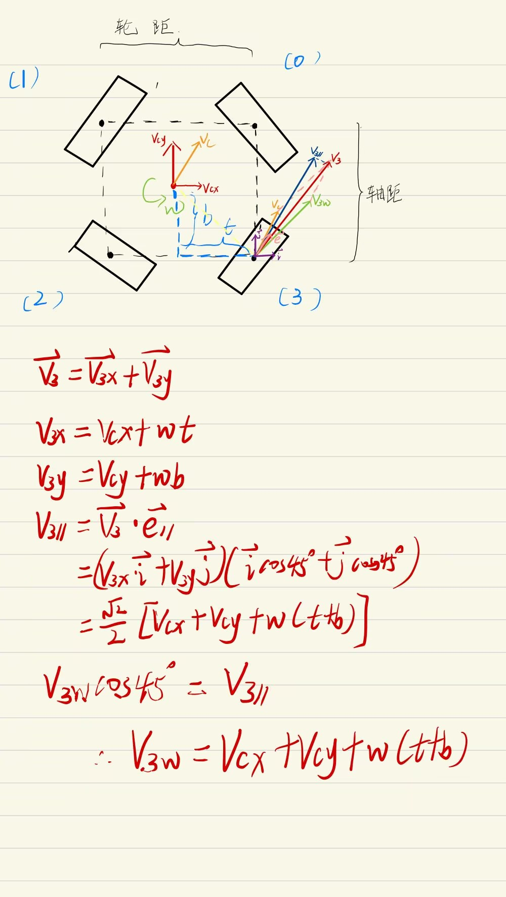
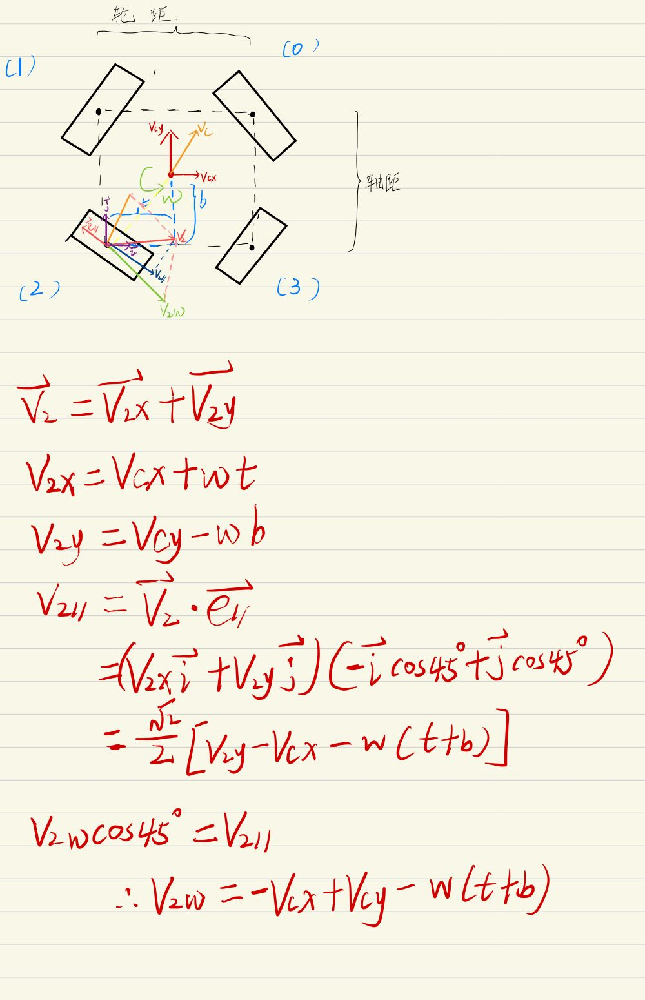
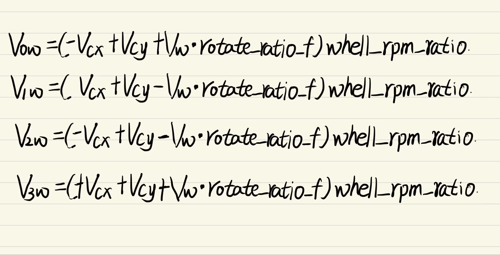
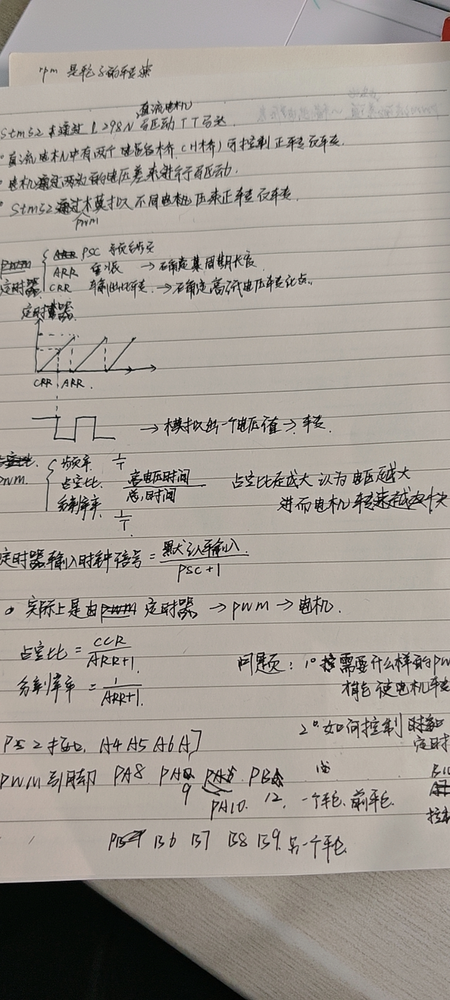

[TOC]

# 机器人

## 麦轮

学习用CubeMX创建一个新工程，选择你的芯片型号（如STM32F103C8T6）。

学习配置一个GPIO引脚为输出模式，控制一个LED灯的闪烁。

生成代码，用Keil打开，找到主循环，编写代码让LED闪烁。

使用ST-Link将程序下载到开发板，看到LED闪烁成功。

***\*PWM控制电机转速的代码\****

// 在main.c中

\#include "stm32f1xx_hal.h"

TIM_HandleTypeDef htim3; // PWM定时器

int main(void) {

  HAL_Init();

  SystemClock_Config();

  MX_TIM3_Init(); // PWM初始化（CubeMX生成）

  

  // 启动PWM（50%占空比）

  HAL_TIM_PWM_Start(&htim3, TIM_CHANNEL_1);

  __HAL_TIM_SET_COMPARE(&htim3, TIM_CHANNEL_1, 500); // 假设ARR=1000

 

  while (1) {

​    // 修改占空比控制转速

​    __HAL_TIM_SET_COMPARE(&htim3, TIM_CHANNEL_1, 700); // 加速

​    HAL_Delay(1000);

  }

}

 

***\*编译器读取转速的代码\****

// 在main.c中

TIM_HandleTypeDef htim2; // 编码器定时器

 

int32_t encoder_prev = 0;

float rpm = 0;

 

void Read_Encoder() {

  int32_t encoder_now = __HAL_TIM_GET_COUNTER(&htim2);

  int32_t delta = encoder_now - encoder_prev;

  encoder_prev = encoder_now;

  

  // 计算转速（假设编码器1000线，采样周期10ms）

  rpm = (delta * 60.0f) / (1000 * 0.01f); // RPM = (脉冲数/每转脉冲数) / 时间(分钟)

}

 

 

***\*麦轮运动学原理\****

 

麦轮的核心是矢量合成。一个麦轮底盘通常由四个电机驱动，每个麦轮由两个分力合成运动。

前进/后退： 四个轮子的主辊方向同时向前或向后。

平移（左右滑移）： 左右两侧轮子的主辊方向相反，合成出向左或向右的力。

旋转（自转）： 对角线上的轮子方向相同，同一侧的轮子方向相反，合成出旋转的力矩。

 

 

***\*建立运动学模型\****

 

在代码中定义一个结构体来存储底盘的目标速度，通常包括三个分量：

 

 Vx ：X方向（前后）速度

 Vy ：Y方向（左右）速度

 Vw ：旋转角速度

 

***\*编写一个运动解算函数\****，例如  Mecanum_Calculate(int16_t Vx, int16_t Vy, int16_t Vw) 。

在这个函数内部，根据麦轮运动学公式，将  Vx, Vy, Vw 分解为四个电机各自的目标转速（M1, M2, M3, M4）。

 

// 在mecanum.h中

typedef struct {

  float Vx;  // 前后速度（mm/s）

  float Vy;  // 左右速度（mm/s）

  float Vw;  // 旋转角速度（rad/s）

} Chassis_Speed;

 

// 在mecanum.c中

void Mecanum_Calculate(Chassis_Speed speed, float* wheel_rpm) {

  // 参数：轮距(mm)和麦轮角度(通常45度)

  const float L = 150.0f; // 轮距

  const float R = 45.0f;  // 轮半径(mm)

  

  // 四个电机的转速计算（运动学公式）

  wheel_rpm[0] = (speed.Vx - speed.Vy - L * speed.Vw) / R; // 右前

  wheel_rpm[1] = (speed.Vx + speed.Vy + L * speed.Vw) / R; // 左前

  wheel_rpm[2] = (speed.Vx + speed.Vy - L * speed.Vw) / R; // 左后

  wheel_rpm[3] = (speed.Vx - speed.Vy + L * speed.Vw) / R; // 右后

}

 

 

 

 

了解到后续的操作过程中需要为每个电机编写一个PID控制器。

PID的作用： 比较电机的目标转速（来自运动解算）和编码器反馈的实际转速，计算出需要调整的PWM值，使实际转速紧紧跟随目标转速。

调试顺序：

先调单个电机的PID：让一个电机能快速、平稳、无超调地达到目标转速。这是最花时间但最重要的一步。

再同时控制四个电机：调用四次PID计算，分别更新四个电机的PWM。

 

 

编写上层代码，给底盘发送指令，例如：

 Mecanum_Calculate(100, 0, 0) // 向前走

 Mecanum_Calculate(0, 100, 0) // 向右平移

 Mecanum_Calculate(0, 0, 100) // 顺时针旋转

 

 

推荐使用的模板

├── Core/

│  ├── Src/

│  │  ├── main.c      # 主循环与初始化

│  │  ├── pid.c      # PID算法

│  │  └── mecanum.c    # 运动学解算

│  └── Inc/

│    ├── pid.h

│    └── mecanum.h

├── Drivers/         # CubeMX生成的HAL库

└── STM32CubeMX/       # CubeMX工程文件

代码：

void chassis_velocity_resolve(float vx, float vy, float vw) {
    static float wheel_rpm[4];
    static float rotate_ratio_f, rotate_ratio_b, wheel_rpm_ratio;
    
    // 根据参数计算转换系数
    rotate_ratio_f = ((WHEELBASE + WHEELTRACK) / 2.0f - GIMBAL_OFFSET) / RADIAN_COEF;
    rotate_ratio_b = rotate_ratio_f;
    wheel_rpm_ratio = 60.0f / (PERIMETER * CHASSIS_DECELE_RATIO);
    
    // 计算各轮转速（RPM）
    wheel_rpm[0] = (vx - vy + vw * rotate_ratio_f) * wheel_rpm_ratio;  // 左前轮
    wheel_rpm[1] = (vx + vy + vw * rotate_ratio_f) * wheel_rpm_ratio;  // 右前轮
    wheel_rpm[2] = (-vx + vy + vw * rotate_ratio_b) * wheel_rpm_ratio; // 左后轮
    wheel_rpm[3] = (-vx - vy + vw * rotate_ratio_b) * wheel_rpm_ratio; // 右后轮
    
    // 控制电机
    motor_control(wheel_rpm);
}

/**
  * @brief  TT马达PWM控制（使用L298N）
  * @param  wheel_rpm: 四个轮子的转速数组
  * @retval 无
    */
    void motor_control(float* wheel_rpm) {
    int pwm_values[4];
    float max_rpm = 200.0; // TT马达最大转速估计值
    
    // 将转速转换为PWM值（0-1000）
    for(int i = 0; i < 4; i++) {
        // 限制转速范围
        if(wheel_rpm[i] > max_rpm) wheel_rpm[i] = max_rpm;
        if(wheel_rpm[i] < -max_rpm) wheel_rpm[i] = -max_rpm;
        
        // 转换为PWM值（假设PWM范围0-1000）
        pwm_values[i] = (int)(wheel_rpm[i] / max_rpm * 500);
        
        // 处理电机方向
        if(pwm_values[i] >= 0) {
            motor_pwm_set(i, pwm_values[i], 0); // 正转
        } else {
            motor_pwm_set(i, 0, -pwm_values[i]); // 反转
        }
    }
    }

/**
  * @brief  L298N PWM控制函数
  * @param  motor_id: 电机编号(0-3)
  * @param  pwm_forward: 正转PWM值
  * @param  pwm_backward: 反转PWM值
  * @retval 无
    */
    void motor_pwm_set(int motor_id, int pwm_forward, int pwm_backward) {
    switch(motor_id) {
        case 0: // 电机1 (左前)
            PWM_Set(0, pwm_forward);
            PWM_Set(1, pwm_backward);
            break;
        case 1: // 电机2 (右前)
            PWM_Set(2, pwm_forward);
            PWM_Set(3, pwm_backward);
            break;
        case 2: // 电机3 (左后)
            PWM_Set(4, pwm_forward);
            PWM_Set(5, pwm_backward);
            break;
        case 3: // 电机4 (右后)
            PWM_Set(6, pwm_forward);
            PWM_Set(7, pwm_backward);
            break;
    }
    }

## PS2

步骤：创建工程并选择MCU型号→配置引脚→生成代码→编写代码解析数据

#include "ax_ps2.h"
#include "main.h"

// PS2???????????
#define DI_PORT     GPIOA
#define DI_PIN      GPIO_PIN_4

#define CMD_PORT    GPIOA
#define CMD_PIN     GPIO_PIN_5

#define CS_PORT     GPIOA
#define CS_PIN      GPIO_PIN_6

#define CLK_PORT    GPIOA
#define CLK_PIN     GPIO_PIN_7

// ?????IO??
#define DI()        HAL_GPIO_ReadPin(DI_PORT, DI_PIN)
#define CMD_H()     HAL_GPIO_WritePin(CMD_PORT, CMD_PIN, GPIO_PIN_SET)
#define CMD_L()     HAL_GPIO_WritePin(CMD_PORT, CMD_PIN, GPIO_PIN_RESET)
#define CS_H()      HAL_GPIO_WritePin(CS_PORT, CS_PIN, GPIO_PIN_SET)
#define CS_L()      HAL_GPIO_WritePin(CS_PORT, CS_PIN, GPIO_PIN_RESET)
#define CLK_H()     HAL_GPIO_WritePin(CLK_PORT, CLK_PIN, GPIO_PIN_SET)
#define CLK_L()     HAL_GPIO_WritePin(CLK_PORT, CLK_PIN, GPIO_PIN_RESET)

const uint8_t PS2_cmnd[9] = {0x01, 0x42, 0x00, 0x00, 0x00, 0x00, 0x00, 0x00, 0x00}; // ????????
static uint8_t PS2_data[9] = {0};  // ?????

/**
  * @brief  PS2???
  * @param  ?
  * @retval ?
    */
    void AX_PS2_Init(void)
    {
    GPIO_InitTypeDef GPIO_InitStruct = {0};

    // ??GPIO??
    __HAL_RCC_GPIOA_CLK_ENABLE();

    // DATA???? - ????
    GPIO_InitStruct.Pin = DI_PIN;
    GPIO_InitStruct.Mode = GPIO_MODE_INPUT;
    GPIO_InitStruct.Pull = GPIO_PULLUP;
    HAL_GPIO_Init(DI_PORT, &GPIO_InitStruct);

    // COMMAND???? - ????
    GPIO_InitStruct.Pin = CMD_PIN;
    GPIO_InitStruct.Mode = GPIO_MODE_OUTPUT_PP;
    GPIO_InitStruct.Pull = GPIO_NOPULL;
    GPIO_InitStruct.Speed = GPIO_SPEED_FREQ_HIGH;
    HAL_GPIO_Init(CMD_PORT, &GPIO_InitStruct);

    // CS???? - ????
    GPIO_InitStruct.Pin = CS_PIN;
    HAL_GPIO_Init(CS_PORT, &GPIO_InitStruct);

    // CLK???? - ????
    GPIO_InitStruct.Pin = CLK_PIN;
    HAL_GPIO_Init(CLK_PORT, &GPIO_InitStruct);

    // ??PS2????
    CS_H();
    }

/**
  * @brief  PS2??????
  * @param  cmd: ??????
  * @retval ?????
    */
    static uint8_t PS2_ReadWriteData(uint8_t cmd)
    {
    uint8_t res = 0;
    uint8_t ref;

    // ????,?????1????
    for(ref = 0x01; ref > 0x00; ref <<= 1)
    {
        // ??????
        if(ref & cmd)
            CMD_H();
        else
            CMD_L();

        CLK_L();
    //        HAL_Delay(1); // ????????????????,???????????
        delay_us(16);

        // ??????
        if(DI())
            res |= ref;
        
        CLK_H();
    //        HAL_Delay(1); // ????????????????,???????????
        delay_us(16);
    }

    return res;
    }

/**
  * @brief  PS2?????????
  * @param  *JoystickStruct ???????
  * @retval ?
    */
    void AX_PS2_ScanKey(JOYSTICK_TypeDef *JoystickStruct)
    {
    uint8_t i;

    // ????
    CS_L();

    // ??PS2??
    for(i = 0; i < 9; i++)
    {
        PS2_data[i] = PS2_ReadWriteData(PS2_cmnd[i]);
    }

    // ????
    CS_H();

    // ????
    JoystickStruct->mode = PS2_data[1];
    JoystickStruct->btn1 = ~PS2_data[3];
    JoystickStruct->btn2 = ~PS2_data[4];
    JoystickStruct->RJoy_LR = PS2_data[5];
    JoystickStruct->RJoy_UD = PS2_data[6];
    JoystickStruct->LJoy_LR = PS2_data[7];
    JoystickStruct->LJoy_UD = PS2_data[8];
    }

/**
  * @brief  ??????????
  * @uint32_t  udelay: ???????
  * @retval ?
    */

void delay_us(uint32_t udelay)    //??hal?us???
{
  uint32_t startval,tickn,delays,wait;

  startval = SysTick->VAL;
  tickn = HAL_GetTick();
  //sysc = 72000;  //SystemCoreClock / (1000U / uwTickFreq);
  delays =udelay * 72; //sysc / 1000 * udelay;
  if(delays > startval)
    {
      while(HAL_GetTick() == tickn)
        {

        }
      wait = 72000000 + startval - delays;
      while(wait < SysTick->VAL)
        {
    
        }
    }
  else
    {
      wait = startval - delays;
      while(wait < SysTick->VAL && HAL_GetTick() == tickn)
        {

        }
    }
}

问题：配置好ps2后操作摇杆无反应

解决：可能是受其他干扰源影响，属于是信号干扰问题，关闭周围干扰源。

问题：ps2 init初始化没弄对

解决方法：在ps2.h中定义全局变量

问题：ps2接线问题

解决：查阅相关资料弄明白了CMD和DAT功能相同

## 电机马达

问题：初步接线后，轮子转向，左前轮和右后轮的转向不对

解决：逐步单个排查接线，获得

红橙线对应左后轮（A2 A3）红A3  Motor2
蓝紫线 右前（A0 A1）蓝A1       M1
蓝绿 右后（B6 B7）绿B7  M3
黑白 左前（B8 B9）黑B8    M4
紫色GND

## 关于制作与实操过程中遇到的困难与解决方案

### 电控组

1、关于代码的学习与编写，从零基础到实操编写这是花费大量精力与时间的过程。对于这个问题唯有凭学习与实践才能克服。

2、第二个是对于小车各项参数的编译，这个方面包括麦克纳姆轮、舵机的解算。当然凭借网络资源查找与学习是一样可以解决的。

3、最困难的一个问题就是材料物件不稳定性大于人为因素，只有通过不断调整参数才能够适应小车运动情况，对于这个问题解决，要特别感谢热心的学长学姐给予帮助与指导（真的真的很大帮助）。

### 机械和硬件

1、早期学习solidworks，同样也是花费大量时间与精力，到后来上手才越来越熟练，能够达到比赛需要预期。

2、在完成3D打印之后最大的问题就是适应比赛尺寸与修改现有物件尺寸达到稳固的连接的效果。对板子的切割材料切割甚至用到了大型切割机（本人亲自动手），需要学会各种工具的使用。

3、整合所有物件是最后一个问题，需要对物件强行塞入，就会面对滑丝、扩孔等一系列问题。还要保证整体的稳固与接合（毁灭吧）。

